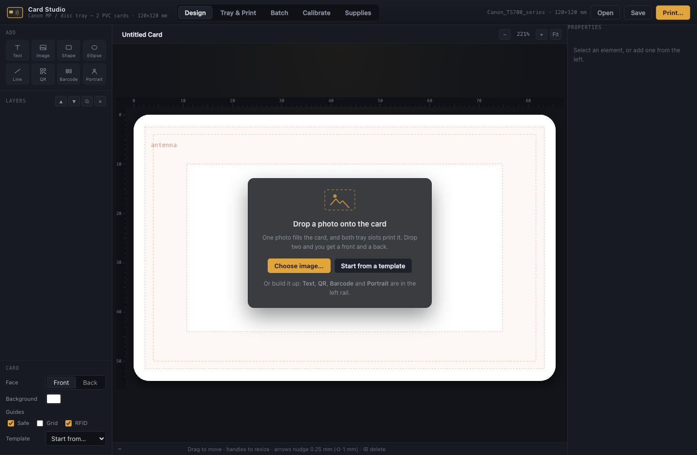

# Vibe Cards

**Standardized custom RFID cards for vibe-coding projects.** Design and print **CR-80 ID
cards** on a desktop inkjet — two at a time, through the printer's disc / multi-purpose
tray — with a **3D-printable RFID reader enclosure**, so the cards you print are cards you
can also scan.

Three things in one repo:

| | |
|---|---|
| **Wish It Better framework** | [`WISH_IT_BETTER.md`](WISH_IT_BETTER.md) — the portable, self-amending loop + eval standard that networks tools like this one |
| **Custom RFID reader case** | [`hardware/rfid-reader-case/`](hardware/rfid-reader-case/) — printable enclosure + parametric generator |
| **Custom ID app for the tray** | `Card Studio` — the designer and print driver in [`src/`](src/) |

**Try it in your browser — no install:** [mrdirno.github.io/vibe-cards](https://mrdirno.github.io/vibe-cards/)
designs a card and exports a print-exact PDF. The desktop app is what drives the printer
directly (tray validation, no-ink dry run, real print path).

**Agents: start at [`CLAUDE.md`](CLAUDE.md).** Clone it and it works — no install step, no
build, stdlib only.

Built by **[Aldrin Payopay](https://www.linkedin.com/in/aldrin-payopay-b63a26288/)** — an AV
guy just trying to hang TVs in peace. ([How it was built](#how-this-was-built) ·
[Where it goes next](docs/ROADMAP.md))



*macOS · Python 3 stdlib only · no install step · MIT*

**Why this exists.** Commercial ID-card printers start around $1,000. A $150 inkjet with a
disc tray can put ink on the same CR-80 blanks to within a few hundredths of a millimetre
— the hard part was never the printing, it was the geometry, and that is what this solves.

| | |
|---|---|
| **Start here** | [Quickstart](#quickstart) · [How it prints](#how-it-prints) |
| **Rebuild it from scratch** | [AGENT_REPLICATION.md](AGENT_REPLICATION.md) — exact procedure, human or agent |
| **The hardware** | [hardware/rfid-reader-case/](hardware/rfid-reader-case/) — printable enclosure + generator |
| **Contribute / request** | [CONTRIBUTING.md](CONTRIBUTING.md) · [file a wish](../../issues/new?template=wish.yml) |
| **How we prove changes** | [WISH_IT_BETTER.md](WISH_IT_BETTER.md) · [docs/EVALS.md](docs/EVALS.md) |
| **Security** | [SECURITY.md](SECURITY.md) — it runs a local server; read this |

> **Platform:** macOS only today. Printing goes through CUPS (`lp`/`lpstat`) and the window
> through `open`. The design surface, PDF composer and geometry model are all
> platform-neutral, so a Linux port is mostly a printing seam —
> [and it is the most wanted contribution](../../issues/new?template=platform-port.yml).

**What these pages actually do:** [`docs/SHOWCASE.md`](docs/SHOWCASE.md) — the interactive surfaces, the constraints they hold to (zero external subresources, renders offline, no account anywhere, 44 px targets at 320 px), and the gate behind each claim.

## Quickstart

```bash
git clone <this repo> && cd card-studio
./build_app.sh          # → ~/Desktop/Card Studio.app, then double-click it
# or run from source:
cd src && python3 server.py
```

It opens on a **blank card**. Drop a photo on it, or pick a template. Both tray pockets
must be loaded on every print, even for one card.

**Before you print on PVC:** run the dry run, then calibrate on plain paper. Tray slot
positions vary by SKU, and that is the difference between a centred card and artwork off
the edge.

---

## How it prints

The TS702a's MP tray prints onto a **120 × 120 mm page** with essentially no margin
(0.1 mm). Your two-card PVC tray is a disc-tray clone, so the two cards sit at fixed
positions inside that square. The app composes a PDF whose page is *exactly* that size,
places each card's artwork at its measured slot coordinates, and hands it to `lp`.

```
design (mm)  →  600 dpi raster  →  exact-geometry PDF  →  lp → CUPS → URF → printer
```

Everything on screen and everything printed comes from one renderer at different
scales, so the preview is the print.

### Verified against the actual printer

- The queue `Canon_TS700_series` is driverless AirPrint, and its own IPP advertisement
  lists `media-source: disc`, `media-type: disc`, and `om_square_120x120mm`
  (`12000` in units of 1/100 mm). A `Validate-Job` for that exact combination was
  answered `successful-ok` by the printer.
- `lp` does **not** scale by default. The app therefore sends **no** `fit-to-page` and
  no `print-scaling` — passing `-o fit-to-page` shrinks the job to ~43%, and
  `-o print-scaling=none` is silently dropped by Apple's IPP backend, so it only
  provides false comfort. Correct geometry comes from the PDF page matching the media,
  which the app enforces and the **Dry run** button re-checks.
- Omitting the media options is the dangerous path: with no `media-col` on the wire the
  printer falls back to Letter from the main cassette and prints your card art on paper.
  The app always sends all three of PageSize / InputSlot / MediaType.

## The four tabs

**Design** — card canvas with millimetre rulers. Text, images, shapes, QR (auto version
selection, warns when modules get too small to scan) and Code 128 barcodes. Front and
back faces. Drag an image straight onto the card. Arrow keys nudge 0.25 mm.

**Tray & Print** — shows both slots on the real 120 mm page, picks which face goes in
each, and exposes the printer's actual media options read from its driver.
*Dry run* pushes the job through the real CUPS filters and reads the output raster back
(expect `2834 × 2834 px @ 600 dpi, 24 bpp`) so you can confirm geometry with no ink.

**Batch** — paste CSV, use `{{Header}}` in any text/QR/barcode, and the app walks you
through the run two cards per tray load.

**Calibrate** — per-machine X/Y offset, stored outside any design. Prints a target with
two numbered millimetre ladders; you read the lowest tick still visible on each.

**Supplies** — what to buy and, more usefully, the exact words to search for. Copyable
search strings, must-say vs avoid keywords, and why each spec matters. Edit
`src/supplies.json` to change any of it. Setting `affiliate.amazon_tag` there appends an
Associates tag to every Amazon link from that one place; empty (the default) ships plain
links.

## Loading the tray — order matters

1. Send the job **first**.
2. Wait for the printer to ask for the tray. Canon warns that mounting it early
   **can damage the printer**.
3. Seat both cards, slide the tray in until the arrows align, press **OK on the printer**.

Both slots must carry a card even when you only want one printed — put a blank in the
other. If a job seems to vanish, the CUPS queue has probably been left stopped by an
earlier backend failure: **Re-enable print queue** in the Output panel fixes it.

## Designing for RFID cards

The **RFID** guide draws the ISO/IEC 14443-1 Class 1 antenna keep-out: the coil lives in
a band between a centred 81 × 49 mm rectangle and a centred 64 × 34 mm one — a frame
8.5 mm wide at the sides and 7.5 mm top and bottom, starting only ~2.3 mm in from the
edge.

**A 3–4 mm trim margin does not clear the antenna.** The only guaranteed antenna-free
area is the centred **64 × 34 mm** rectangle — put portraits, fine detail and barcodes
there. The chip sits on the coil and is the highest point on the card, so expect a slight
dimple in flat tints.

Other practicalities: use tray bleed (~0.95 mm), not the 3 mm print convention — there is
no trim step and excess bleed just sprays ink into the tray pocket. Keep small text and
barcodes pure black. Stock must be sold as *inkjet-printable* PVC; raw PVC repels ink.
Prefer 30 mil / 0.76 mm — RFID stock is often 33 mil and can foul a tray cut for 30.
Let cards dry ≥90 s before handling, and 24–48 h before laminating.

## Calibration

The shipped slot coordinates come from three independent vendor artifacts for the Canon
MP-tray 2-card carrier that agree to within 0.0005 mm:

| | x (mm) | y (mm) |
|---|---|---|
| Top slot | 17.553 | 3.818 |
| Bottom slot | 17.553 | 63.868 |

Note they are deliberately *not* symmetric — the pair sits 0.353 mm right of centre and
high. That asymmetry is itself evidence the numbers are measured rather than idealised.

**Your tray may be a different SKU.** At least five MP-tray variants fit a TS702a and
moulded pockets can differ by ~1 mm, so run the calibration print before committing card
stock. Which physical edge of the square leads into the printer is not documented
anywhere we could verify — the target is deliberately asymmetric so a 180° tray
orientation is obvious immediately.

## Layout

```
apps/card-studio/
  build_app.sh          builds ~/Desktop/Card Studio.app (self-contained)
  src/
    server.py           local app server, CUPS bridge, print pipeline
    pdfwriter.py        stdlib-only exact-geometry PDF writer
    profiles.json       tray geometry, media options, card + RFID spec
    make_icon.py        generates the app icon
    web/                the designer UI (one renderer, many scales)
  tools/
    verify.mjs          end-to-end checks driving the real UI in headless Chrome
    measure_geometry.py renders the PDF with Quartz and measures ink position in mm
```

Files live in `~/Library/Application Support/Card Studio/` — `designs/`, `output/`
(every PDF it prints is kept), and `settings.json` (printer + calibration).

Self-contained by design: the bundle carries its own copy of everything, so it keeps
working when the volume it was built from is unplugged. After editing `src/`, re-run `./build_app.sh`.

## Tests

```bash
node tools/verify.mjs                # 14 checks through the real UI
python3 tools/measure_geometry.py    # measures printed ink position in mm
```

`measure_geometry.py` posts solid-colour cards through the real print path, renders the
PDF with Quartz at 20 px/mm and measures where the rectangles land. Last run: both slots
within **0.02 mm** of specification (the measurement raster's own pixel size), and a
calibration offset moved the ink by exactly the requested amount.


## Web build vs desktop app

Same designer, same geometry, one `app.js`. They differ only in what answers the API — see
`src/web/backend.js` (desktop, HTTP) and `src/web/backend-static.js` (browser).

| | Web (GitHub Pages) | Desktop app |
|---|---|---|
| Design cards, templates, QR/barcode | yes | yes |
| Print-exact PDF | yes — you print it | yes |
| Drive the printer directly | no | yes |
| Tray validation / no-ink dry run | no | yes |
| Batch from CSV | not yet (needs multi-page PDF) | yes |
| Saved cards | this browser's storage | files on disk |

The web build's PDF is the same geometry the desktop prints — proven, not asserted:
`tools/pdf_parity.mjs` diffs the JS composer against `src/pdfwriter.py` on every
placement and rotation, and CI blocks the deploy if they diverge.

> **Print it at 100%.** The one thing that will silently ruin a card from the web build is
> a print dialog set to "Fit to Page", which scales a 120 mm page down and prints perfect
> undersized cards. The PDF asks not to be scaled (`/PrintScaling /None`), but not every
> driver honours that, so set Scale to 100% yourself.

## Make it your kit

The Supplies tab ships as a generic buying guide — which reader you own and which stock
you bought is *your* kit, not the project's, so it is not in the repo. Record it locally
and the guide becomes yours:

```bash
$EDITOR ~/Library/Application\ Support/Card\ Studio/my_supplies.json
```

```json
{
  "your_reader": { "model": "…", "proven_type": "125 kHz EM4100 only" },
  "owned": {
    "rfid-125": {
      "vendor": "…", "product": "…", "url": "https://…",
      "pack": "50 cards", "price": "$39.99",
      "why": "Matches the reader I already own."
    }
  }
}
```

It merges over the shipped guide at runtime, is never committed, and a malformed file
degrades to the generic guide rather than taking the app down.

## Contributing, and the loop

This project runs the [Wish It Better loop](WISH_IT_BETTER.md): wishes are cheap to file,
every one reaches a terminal state, every shipped change carries an eval that could have
failed, and the lesson gets written next to the code.

The standard is **portable and self-amending** — copy `WISH_IT_BETTER.md` into your own
project, declare a level in `wish-it-better.json`, and when the spec fails you, amend it.
Amendments propagate to every adopter. That is what makes it compound instead of just
exist.

Start with [CONTRIBUTING.md](CONTRIBUTING.md).


## Author

**Aldrin Payopay** — an AV guy just trying to hang TVs in peace.
[LinkedIn](https://www.linkedin.com/in/aldrin-payopay-b63a26288/) · Persona 500 LLC · MIT.

Vibe Cards came out of a working problem, not a product plan: commercial ID-card printers
start around $1,000, a desktop inkjet with a disc tray does not, and the gap between them
is entirely geometry. The reader needed a case, the case needed a generator, the cards
needed an app, and the whole thing needed a way to keep getting better after the first
push. That last part became [Wish It Better](WISH_IT_BETTER.md).

## How this was built

Openly, because the method is part of what is being shared — and because a security claim
you cannot audit is worth nothing.

**Direction, judgement, hardware and every product call:** Aldrin Payopay.
**Implementation and verification:** Claude Opus 5 (`claude-opus-5`), orchestrating a
multi-agent workflow, in [Claude Code](https://claude.com/claude-code).

The part worth copying is the **audit**, not the code generation. Before release, a
**20-agent adversarial workflow** ran over this repo — four parallel audit lanes
(security, packaging, robustness, first-run UX), then sixteen independent verification
agents whose default verdict was *refuted*, each required to reproduce a finding at source
or drop it. ~1.33M tokens, 378 tool calls, ~15 minutes wall clock.

It found two **live-proven blockers** in an app that had been in daily personal use and
"worked fine":

- `/api/design/<name>` joined request data into a filesystem path. `pathlib` silently
  discards the base when the input is absolute, so **any JSON file on the machine was
  readable** — the audit pulled `~/.docker/config.json` off a running instance.
- No `Host`/`Origin` validation and no auth, so any web page the user visited could kill
  the app, drive the printer or write its settings — and DNS rebinding upgraded that to
  reading the responses.

Both are fixed, and both exploits were re-run against the published artifact from a clean
clone. That before/after table is in [`docs/EVALS.md`](docs/EVALS.md) §1, with its limits
named.

**Working fine is not an eval.** That is the lesson the whole framework is built around,
and it is why [Wish It Better](WISH_IT_BETTER.md) §2 asks for the observation that would
have proven you wrong — *before* the fix.

## Licence, and the one thing it does not cover

MIT — [`LICENSE`](LICENSE), which is what GitHub's licence API reports and what this
network's second criterion checks. The hardware under `hardware/` is the same MIT terms,
restated in [`LICENSE-HARDWARE`](LICENSE-HARDWARE) as a separate file because anything
appended to the canonical MIT text makes the detector return NOASSERTION.

**Read [`NOTICE`](NOTICE) before you reuse anything from this tree.** It is short, it only
ever takes away, and it names the material here that is *not* this project's to grant: the
Guatemala card artwork, which the card's owner commissioned, and the two embedded typefaces,
which stay under SIL OFL 1.1 and never under MIT. A `NOTICE` beside an MIT licence has no
force the way Apache-2.0 §4(d) gives it — it works only if you find it, which is why it is
linked here, served at
[mrdirno.github.io/vibe-cards/NOTICE](https://mrdirno.github.io/vibe-cards/NOTICE), and
pointed at from the page that carries the artwork.

Attribution is not a carve-out. The artwork already carried a credit in three places, and a
credit does not reduce a grant by one word — that is what `NOTICE` is for.
