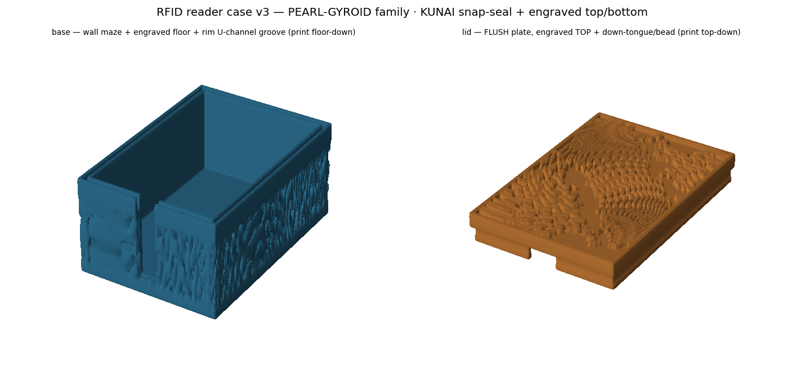

# RFID reader case — v8 top half, v7 bottom half

A two-piece printable enclosure for a USB RFID reader board, so the reader is a device on a
desk rather than a bare PCB on a cable. Print both halves, drop the board in, close it.

**Three things to know before you spend the filament.**

1. **Nothing here has ever been printed.** Every number on this page comes from the two mesh
   files, and from the machine instructions a slicer produced from them. None of it came off
   a bed.
2. **The lid is measured to hold on two sides, not four — and they are adjacent, not
   opposite.** The retention bead on the base clears the other long side and the other end by
   0.223 and 0.224 mm and never touches them. Read *The snap fit* below before you print more
   than one set.
3. **Budget about 3 h 08 min and 63 g** for the pair on the stock profile named below, in two
   separate prints.

**What is new in this revision:** the top half had a real hole in its outer wall near the
seam. This revision closes it. The bottom half is unchanged, byte for byte.

*(A computer render of the v3 ancestor — not a photograph, and not either file below. It
shares the seal mechanism and the surface treatment but not the split: v3 is a deep tray with
a thin lid, while the two files below are near-equal clamshell halves, 13.996 mm and
11.999 mm tall. Do not read the proportions in this picture as the parts you will get.)*

## Files

| File | What | sha256 |
|---|---|---|
| `rfid_case_bottom_v7.stl` | bottom half — unchanged from v7 | `f5597c8bbcc23a35560c01763496504edf2f737006ddb0e9a321f0043882853d` |
| `rfid_case_top_v8.stl` | top half — the revision | `5d8c2146bb54201527ad113cf1b39bf384c080bfde6b3249ac4df52d0d7cd359` |
| `rfid_case_top_v7.stl` | old top half — this is the one with the break. Kept only so the published hash lineage stays checkable. **Do not print it.** | `93abf3eeca46481cefd990d28527d42ca45672701ebc46edf769b081b26845d3` |
| `gen_rfid_reader_case_v7.py` | the generator that produced the v7 pair | — |

To check a download: `shasum -a 256 <file>` on macOS, `sha256sum <file>` on Linux,
`certutil -hashfile <file> SHA256` on Windows.

**The two file names do not match, and that is deliberate.** Only the top half changed, so
only the top half got a new version number. The bottom half keeps its v7 name because it is
the same bytes it always was — if you compare it against the file you downloaded before, no
byte differs. Print `rfid_case_bottom_v7.stl` and `rfid_case_top_v8.stl` together. They are
the pair.

The revised top is 12,593,284 bytes. The bottom half is 13,186,284 bytes.

`rfid_case_top_v7.stl` is still in this directory, one character away from the one you want —
and `bottom_v7` with `top_v7` is the pairing that *looks* matched. It is not. That file is the
old top half, the one with the break; its hash is in the table above. If you already have it,
replace it, and reprint the top half if you printed one.

### About the generator

The generator published here is the one behind the v7 pair: the unchanged bottom half and the
**old** top half, the one with the break. It does not produce `rfid_case_top_v8.stl`, and the
generator that does produce it is not published.

Two things to know before you run it. It writes into its own folder, so it will create
`rfid_case_top_v7.stl` — the broken top, under the name we just told you to delete — right
next to the good one, with nothing but a digit to tell them apart. And it will overwrite
`rfid_case_bottom_v7.stl` with bytes we have never checked against the hash above.
**Regenerate in an empty directory, keep the downloaded bottom half, and delete the
`_top_v7.stl` it leaves behind.**

So be clear about what you have. The bottom half comes with its source. The revised top half
does not — it is a mesh, and you have to take it as given. Changing the cavity for a
different board is still a handful of constants at the top of the published file, but doing
that gets you a top half with the old break in it unless you also fix the seam band yourself.
We would rather say that plainly than imply a reproducibility that is not there.

---

## The break in the old top half

Measured on the old file, the top half's outer wall was **open** near the seam: draw
horizontal lines across the part and some of them pass clean through it without touching any
material.

That is not only a property of the mesh. Both top halves were run through OrcaSlicer 2.3.1 on
the unmodified Anycubic Kobra S1 0.4 mm vendor profile, in the pose this page tells you to
print, and the machine instructions were read back. Walking 314.0 mm of outer wall in 0.25 mm
stations — corners trimmed, the designed USB opening excluded — the slicer leaves up to
**100.75 mm of that wall with no plastic at all**, three consecutive layers losing 73.75 mm or
more, with a longest single break of 6.50 mm. **It does not bridge it.** On the revised top
half the same measurement reads **0.00 mm on every layer of the joint band** — the band is the
five printed layers that cross the joint, and the old part loses 100.75, 90.50, 73.75 and
9.00 mm on four of them. The control for that instrument is a band of ordinary, undamaged wall
on the same two parts: 0.00 mm dry there, on eight layers each.

Assemble the old pair in the closed position and look at the four side walls from outside:
**30.38 mm² of them is open to daylight** — 14.52 mm² on each of the two long walls and
0.67 mm² on each of the two short ones. At its widest, one wall is open across 27.70 mm of its
length, broken into twelve separate slits. On the revised pair the same measurement reads
**0.00 mm²** on all four walls. Both figures set aside the USB port, which is an opening on
purpose: the assembled case is open there whichever top half you print.

The cause is arithmetic. The seam groove is cut in behind the outer face, which leaves the
outer seal lip much thinner than the 3.000 mm the wall is elsewhere. The surface pattern is
engraved 1.5 mm deep. One millimetre above the top half's own lowest surface that seal lip
measures **0.9324 mm** on two walls and **1.4531 mm** on the other two — both thinner than the
cut. Higher up the lip thickens: across 2.35 to 3.00 mm, the band that actually opens, the
revised file (where the pattern is held off) carries 0.94 to 2.05 mm on the thin pair and 1.46
to 2.25 mm on the thick pair. So the thinning is the cause, but one subtraction does not size
the break. Over that same band on the old file, up to a third of the stations we probed have
no material at all. The bottom half is unaffected because its seam feature is a tongue
that stands proud of the joint rather than a groove cut behind it, so nothing thins its wall
there.

Note that the generator's own header says the pattern is never carved through the wall. On the
old top half, in this band, that was not true.

### Where the page was wrong about the size of it

This page first called the break a band 0.5 mm tall, then corrected itself to **3.0 mm** and
said the smaller figure had been our sampling rather than the part. **That correction
overshot.** The 13 bad heights it counted are real, but they are not one band: two of them sit
0.05 mm and 0.10 mm above the top half's own lowest surface, the other eleven run from
2.50 mm to 3.00 mm above it, and the 47 heights in between are shut. The 3.0 mm was the
distance from the lowest bad height to the highest — 2.95 mm, rounded up — measured straight
across sound wall.

The through-cut itself measures **0.50 mm** by that same test, from the first open height to
the last. A second instrument that probes each wall separately, from its own side, puts it at
**0.65 mm** first-to-last, or 0.70 mm of slices occupied. A third, which looks straight through
the closed pair, measures the opening as **0.600 mm** tall on the two long walls and 0.400 mm
on the two short ones. Call it half a millimetre to seven tenths, and note that the honest
form of this figure is a range and not a single number. The 0.5 mm figure this page threw away
was closer than the one that replaced it.

We are also retiring the open-line counts this page used to quote, and you should treat any
such count with suspicion, including ours. How many lines come back open is a property of how
finely you probe, not of the part.

*Where* the break is does stay put. The per-wall instrument — which finds 16 open heights
rather than 13, because it also catches 2.35, 2.40 and 2.45 mm, where only the two thinner
lips are cut — returns that identical set of 16 at probe-line spacings of 0.02, 0.05 and
0.10 mm and with the probe grid shifted half a step.

The bottom half is clean, and always was: the two-sided test at the same fine 0.05 mm spacing
returns zero at all 279 heights through it.

> **How heights are quoted here.** Unless a line says otherwise, a height is measured up from
> the top half's own lowest surface — absolute z 11.250967 in that file's own frame. That
> surface is the bottom edge of the seal lip, **not** the face that carries the load: the
> bottom half presents its mating land higher than that, and the two meshes overlap by 0.285
> to 0.502 mm there, so the top's lowest edge is buried inside the joint.
>
> It also sits 0.25 mm below the design mid-plane, which is the datum some of our own
> instruments measure from. Between that and the different ways our tests locate the joint,
> two heights on this page can disagree by a quarter of a millimetre and both be right. Do not
> compare heights from two different tests down to the last decimal.

### What the revision repairs

Between 2.50 mm and 3.00 mm above the top half's lowest surface, all four side walls of the old
top half are
cut through; the two thinner seal lips break first, at 2.35 mm. On the revised top half every
one of those heights is shut, on every wall. A second test swept 51 heights across the same
band at 0.25 mm station spacing and found every station closed on all four walls — 385, 385,
245 and 193 stations per wall — where the old part reads up to 123 of those 385 stations open
on one wall. That count, like every count on this page, is a property of the 0.25 mm spacing
as much as of the part; the zero is the part.

The topology agrees, though it is weaker evidence than it looks. Both halves are watertight
single bodies. The old top half's surface has genus 41; the revised top half reads **4**, which
is what the bottom half has always read. That counts handles in the surface, which is not the
same as holes you can see through. The line test and the toolpath are the evidence; the genus
is a hint that pointed at which half to look at.

The repair costs surface pattern. It stops carving the relief over a band around the joint, so
**148.00 mm² of pattern is gone** from the four side walls — 44.00, 53.05, 21.45 and
29.50 mm². Above the joint the revised top leaves a plain unpatterned band of 3.954 to
4.055 mm where the old one left 2.355 to 2.455 mm. Below the joint both leave 2.446 mm,
because the bottom half did not change.

### What the revision does not repair

At the very bottom edge of the top half, **two of the four walls begin 0.1185 mm higher than
the other two** — less than one 0.20 mm print layer. Measured against the part's own lowest
point, those two walls first carry material at 0.126233 mm and the other two at 0.007697 mm,
identical to six decimals in the old file and the revision. The fine line test still flags two
heights on the revised file because of it, at 0.05 mm and 0.10 mm up, and they are the same two
the old file has.

At the ordinary 0.20 mm probe spacing the revised file flags either none of them or one,
depending on where the ladder starts: none if its first plane is 0.20 mm or more above the
part's lowest surface, one if a plane happens to land on 0.05 or 0.10 mm. That is a property
of where you start probing, not of the part — the same objection this page raises against its
own retired 3.0 mm figure.

It is not a hole, and it is not something you will ever see. Measure each wall from its own
bottom edge rather than from the lowest point of the whole part and all four walls are solid
and unbroken at every height tested from 0.01 mm to 1.00 mm, on both files. That edge is also
buried inside the joint, as the note above says. Assembled, the revised pair is open to
daylight over 0.00 mm² outside the USB port.

The seal lip's lopsidedness is not repaired either, and it matters more than the step does.
See the snap-fit section below before you print a batch.

### Does the new top fit a bottom half you already printed?

Measured on the files, yes: the revised top half mates the unchanged bottom half exactly as
the old top half did, and the bottom half file has not changed. So a bottom half you already
printed is still good — **reprint the top half only, and keep the base you have.**

Seated in the designed position the two pairings differ by **0.0324 mm³** of interference
volume, which is 0.0225 percent. The revision only adds material — 316.3398 mm³ added to the
top half, 0.0094 mm³ removed — and 99.8 percent of the addition sits at least 1.5 mm above the
mating plane. Of everything that differs between the two top halves, **0.0329 mm³**, about one
hundredth of one percent of the change, occupies space the bottom half also occupies. Both
pairings hold the same 2.4947 mm of axial engagement and the same amount of snap retention —
1700 sampled columns at a 0.10 mm pitch, about 17 mm² of undercut. Read that as *unchanged by
the revision*, not as *sound*: the same measurements put almost all of it on two of the four
walls. See the snap-fit section.

Around the seam, the tongue-to-groove fit inside the joint is lopsided in the same way the
snap is, and on the same two sides in both pairings. On two sides the halves are modelled in
interference over most of the joint — median −0.0020 mm and 58 percent of measured stations
negative on the revised pairing, −0.0012 mm and 54 percent on the old one; the tightest
station, −0.3086 mm, is the same in both. On the other two they are loose along their whole
length in both pairings — median +0.5066 mm, not one station negative, against a design
intent of 0.2 mm per side.
Almost none of the joint is at the intended 0.2 mm. This is an internal fit between the tongue
and the groove, not the seam line you see from outside. Expect to press two sides home.

The widest gap in the seal path narrows from 1.4761 mm on the old top to 0.7578 mm on the
revision.

Nothing above has been printed. It is a comparison of two files against a third.

---

## The snap fit — read before printing a batch

The halves close with a **tongue-and-groove joint plus a retention bead**, rather than a thin
lid on a deep tray. The split *is* the Z mid-plane, as the generator's own constants say, but
the two bounding heights are not equal: the bottom measures **13.996 mm** tall and the top
**11.999 mm**, because the bottom's tongue reaches up past the seam plane and into the top's
groove — the two halves overlap by 2.4947 mm where it does. An earlier version of this page
said both halves were about 11 mm, and a later one said the split was not the mid-plane; both
were wrong.

**The seal lip is not the same all the way round, and the snap only works on half of it.** At
its thinnest — 1.749 mm above the top half's own lowest surface — the lip measures
**0.5572 mm** on two of the four walls and **1.1981 mm** on the other two. The lip is a rounded
bullnose and changes fast there, so the height belongs with the figures: a quarter of a
millimetre lower, at 1.500 mm above the same surface, the same two pairs read 0.7557 mm and
1.3125 mm.

That difference persists all the way up the lip, but it is not constant. The thicker pair
carries about 0.51 mm more material than the thinner pair over most of the band, widening to
0.64 mm at the plane where the thin lip is thinnest, and falling to 0.20 mm by 3.00 mm above
the part's lowest surface, where the lip reads 2.05 mm on the thin pair and 2.25 mm on the
thick pair — still short of the 3.000 mm the wall is elsewhere.

The consequence is not the thin lip itself. It is the snap. The bead on the base protrudes
0.1882 mm past the tongue face against a designed 0.5 mm, and on the two thin walls it **clears
the lip by 0.2233 and 0.2236 mm and never touches it**. On the other two walls it engages at
0.2841 and 0.2839 mm of interference against a designed 0.3 mm. A boolean check on the two
meshes during insertion says
the same thing a different way: at a 1.0 mm insertion lift the two engaging walls carry 933 and
585 overlapping vertices, the two clearing walls 3 and 3. So the case is held shut by two walls
that meet at a corner — one 112 mm long side, and the 77 mm end the USB window is in — and not
by the two opposite them. The answer does not change anywhere across the 0.00 to 0.55 mm range
of seating offsets we swept.

One of those two retainers is the end the window is cut through, and the window interrupts its
seam ring for 11.0 mm at the centre of a 77 mm wall — widening to 15.0 mm where it crosses the
ring itself. So the shorter of the two retainers is a bead in two pieces rather than one
continuous run, and the interruption is at its midpoint.

> **Expect the lid to hold on two sides rather than four.**
>
> Nothing has been printed. That is what the files say the joint does, not what a printed pair
> does. **Print one set and try the fit before printing several.** If it will not seat, raise
> the tongue clearance and regenerate; if it will not stay shut, raise the bead diameter. Both
> are single constants near the top of the published generator — which produces the old top
> half, so read the generator section above first.
>
> When the first half comes off the bed, measure across the 77.000 mm face with calipers.
> Whatever you read minus 77.000 is your printer's dimensional error in that axis. The bead the
> lid hangs on protrudes 0.1882 mm and engages by 0.284 mm, so two tenths of a millimetre is
> the whole budget: over, and the lid will be tight on the two engaging walls; under, and it
> may not catch at all. Without that measurement you cannot tell a design limit from your own
> printer.

This lopsidedness is inherited, not introduced by the revision. At the same height the old top
half measures 0.5560 mm on the thin pair: the repair moved the lip by 0.0012 mm.

The two meshes also overlap at the mating land — by 0.285 to 0.502 mm, depending where on the
land you measure — and printed plastic cannot overlap, so a printed pair butts there instead.
As stored, the two files span **23.500 mm** closed, against a design intent of 23.0 mm; that
half-millimetre is outer surface, a quarter of a millimetre proud on each broad face, and not
the joint. Seated so the two lands touch, the pair closes at **24.00 mm**. If you are
designing something around this case, allow 24 mm rather than 23. We cannot give you the
figure a printed pair would measure — only the shape of the files.

### What a slicer does with the thin lip

The revised top half was run through OrcaSlicer 2.3.1 on the same unmodified Anycubic Kobra S1
0.4 mm vendor profile used above — 0.20 mm layers, 0.42 mm external perimeter, classic wall
generator, stock 15 % infill and two walls — and the machine instructions were read back a
second way, this time counting beads rather than gaps.

On **1 layer of 60** — the only one where the whole ring drops to a single bead, 1.699 mm above
the top half's own lowest surface — the
two thin walls collapse to a **single 0.6549 mm bead running 180.77 mm** around the lip. The
layers immediately above and below lay two beads of 0.42 mm each, overlapping at 0.285 to
0.347 mm centre to centre, and no part of the ring is thinner than 0.42 mm, so the lip is
continuous solid plastic rather than a gap. Through the same band the two thick walls get three
beads: 0.42 mm, then 0.45 to 0.59 mm of gap infill, then 0.42 mm again.

Do not cut wall count or flow through that band, and look at that one line on the lid before
you trust it. This is what one named profile does with one file; it is not a statement about
your printer. A profile with a narrower external perimeter, or the Arachne wall generator
instead of the classic one, may place two beads there where this one places one.

---

## Print settings

- **Both halves broad-face DOWN**, seam up. The seal features open upward in that pose.
- The two STLs share one coordinate frame. The bottom half loads the right way up; the
  **top half loads upside down and must be flipped before slicing**, or you will print the
  seam against the bed.
- **Time and filament**, on that same stock profile: top half 1 h 32 m 20 s and 30.24 g over
  60 layers, bottom half 1 h 36 m 07 s and 32.84 g over 70 layers — **3 h 08 m 27 s and
  63.08 g** for the pair, as two separate prints.
- **Supports:** the profile has them switched off and neither half asks for any. There is not
  one support extrusion in either set of machine instructions; the pattern-recess ceilings come
  out as overhang-wall and bridge moves instead — 262 overhang-wall and 71 bridge blocks on the
  top half, 234 and 52 on the bottom. Each file also carries one internal-bridge block, so if
  you check this yourself by grepping for `Bridge` you will get 72 and 53. That is what one
  named profile does with these two files; it is still not a statement about your printer, and
  nobody has printed it.
- **The surface pattern does overhang**, which an early version of this page denied. Counting a
  triangle as bed contact when it lies wholly within 0.2 mm of the plate, 2,887.157 mm² of the
  revised top half's 27,028.028 mm² of surface sits more than 45 degrees off vertical —
  10.68 percent — and 2,920.043 mm² of the bottom half's 28,399.763 mm², or 10.28 percent. It is
  the ceiling of the pattern recess, not the seal. That figure moves a lot with the rule you
  choose. Count only perfectly flat down-facing triangles as bed contact and the same two parts
  read 4,412.138 mm² (16.32 percent) and 4,445.556 mm² (15.65 percent); with no bed exclusion at
  all, 8,039.882 mm² (29.75 percent) and 8,080.299 mm² (28.45 percent); keep the first rule and
  widen the band to 0.4 mm and the revised top reads 2,146.561 mm² (7.94 percent). None of these
  is a support analysis.
- **Bed:** each half is **77 × 112 mm** as a mesh, but the stock profile adds an automatic brim
  where it wants one, and what lands on the plate is what has to fit. Here the top half's first
  layer measured about **82.0 × 110.8 mm** — the brim reaches 3.9 mm outside the part on one
  side — and the bottom half got no brim at all, its first layer measuring about
  75.7 × 110.8 mm. A 120 × 90 mm bed takes one half only with the long side along the 120 mm
  axis. Turn on the profile's full 5 mm brim all round and the long side becomes 122 mm, and it
  will not fit at all. Either way this is two separate prints.
- The relief on the outer faces is a recess cut 1.5 mm deep, so the flat land around it is what
  touches the bed. The whole patterned face lies on the plate and takes its finish from your
  print sheet. The same 1.5 mm pattern also cuts into the 3.000 mm side and end walls.
- The joint is unchanged by the revision: in the files it is a groove 1.1 mm wide, 0.746 mm deep
  on two walls and 1.149 mm on the other two, and the two halves' outer skins are modelled flush
  to within 0.0009 mm. That last figure is a property of the meshes, not a promise about a print
  — at 0.42 mm bead width and 0.20 mm layers, what you will actually feel is set by layer
  registration and by the 0.285 to 0.502 mm of butting at the land.

### How thin does it get?

**We cannot give you a single smallest wall thickness, and we will not invent one.** The
surface is smoothed, so every rounded crest tapers to nothing and the answer keeps shrinking as
we sample harder: on the revised top half, 0.01686 mm over 8,000 sample points, 0.0021 mm over
60,000 with local refinement, and 0.0014 mm from a second, independent probe that walks solid
runs along the axes. That is a property of the sampling, not of the part.

What we can say, by area, from 8,000 area-weighted samples on each half:

| | revised top half | bottom half |
|---|---|---|
| 0.5th percentile thickness | 0.7325 mm | 1.0528 mm |
| 1st percentile | 0.8185 mm | 1.4750 mm |
| 5th percentile | 1.2637 mm | 1.6864 mm |
| median | 3.9965 mm | 3.9903 mm |
| share of surface over material under 1.0 mm | 3.76 % | 0.44 % |
| share under 2.0 mm | 13.24 % | 7.99 % |

## Nobody has printed this yet

Every number on this page came from the files — the meshes themselves, and the G-code a slicer
produced from them. None of it came from a print.

The revised top half is a watertight single body of 251,864 triangles,
77.000 × 112.000 × 11.999 mm, holding 36.4575 cm³ of solid. The bottom half is a watertight
single body of 263,724 triangles, 77.000 × 112.000 × 13.996 mm and 39.296 cm³. The old top
half, for comparison, was 36.141 cm³. The files here are byte-identical to the ones those
measurements were taken from.

No version of this case has ever come off a bed. Nothing here is a claim about how it prints,
how it fits the board, or how it survives handling. If you print one before we do, we would
like to hear what happened.

## Fit

The generator is written around a 70 × 105 × 14 mm USB reader board with a USB cutout on one
end, allowing 0.4 mm of clearance per side and 1 mm of vertical play.

Measured from the files as they stand, the inside is **71.000 × 106.000 mm** clear and
**15.500 mm** tall floor to ceiling — the same at every one of the 225 points we sampled — the
walls reach **3.000 mm** on all four sides where the surface relief does not cut into them, and
the USB window is **11.0 mm** wide through the wall, widening to 15.0 mm where it crosses the
seam ring on the bottom half. The window runs the full 15.500 mm height of the cavity. Note
that 3.000 mm is the thickness at the flat land between recesses, not the thickness everywhere:
the same 1.5 mm pattern that cuts these walls is what opened the old top half, and calipers on
the outside of a printed wall will bridge a recess rather than find the land.

Check your board against all three before you print — and against a fourth thing those three do
not tell you: **where** the window is. There is one window, in one of the two short (77 mm) end
walls; the other end is closed at every height. Probed outward from the cavity, its edges sit at
32.746 and 43.754 mm across a 77 mm wall — 11.008 mm wide, its centre a quarter of a millimetre
off the middle of that end. The board has only about 0.5 mm of play per side in the 71.000 mm
cavity, so a socket set toward a corner of the board will not line up with the window at all.
Check where your connector sits, not only how wide the plug is. A board taller than 15.5 mm does
not fit inside these files, and a plug wider than 11 mm will not reach through the window. Those
are the files as stored; a printed pair butts where the two meshes currently overlap, so expect
slightly more height inside rather than less.

That window is the only opening in the case. There is no LED window, no light pipe, no cable
strain relief, and nothing holding the board down in a cavity 1.5 mm taller than it. If your
reader has an indicator you need to see or a beeper you need to hear, this case will hide both.

For a different board, change the board's own length, width and height constants near the top
of the generator. The clearance, the wall thicknesses and the USB opening width are separate
constants again, and changing those alone will not resize the cavity. Note there are two wall
constants, not one.

## Lineage

v7 continued the **v3 → v6** line, not the simplified v4/v5 detour:

- **v3** introduced the real tongue-and-groove-plus-bead seal and engraved the gyroid into both
  broad faces (rather than leaving them flat). It was drawn to keep the RF tap surface clear;
  that is a design intention and not a measurement — nothing on this page says anything about
  read range, and no version has been printed, let alone tested with a card. It was a deep
  tray with a thin lid — the shape in the picture at the top of this page.
- **v6** re-split the body at the **Z mid-plane** into two balanced clamshell halves and adopted
  a calmer gyroid cell size so the pattern reads as a surface rather than as noise.
- **v7** was v6 with the tuning settled.
- **v8** is the v7 top half with the pattern lifted off a band around the joint, so the seal lip
  is no longer carved through. Nothing else in the part moved, and the bottom half did not
  change at all.

Licensed MIT — the STLs and the generator in this directory, under `LICENSE-HARDWARE` and
`LICENSE` at the repository root: print it, remix it, sell prints of it. Some other material in
this repository is not MIT; `NOTICE` names it.
